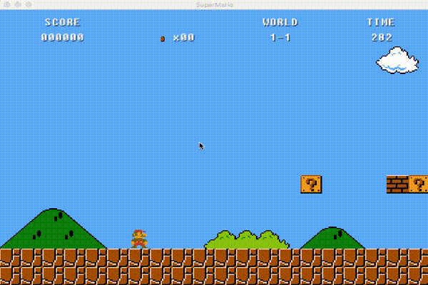
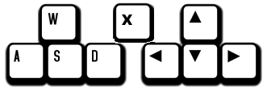

# Mario Bros with libGDX

Platform game like Super Mario Bros 1 using libGDX Library


## Prerequires

1. Git 2.6+
2. Maven 3.6.1+
3. Java 11+


## How to Play

Clone

```
git clone https://github.com/edwarddn/game-do-mario
```

Inside the folder

```
cd game-do-mario
```

Run

```
mvn package -Pdesktop
java -jar desktop/target/game-do-mario-desktop-0.0.1-SNAPSHOT-jar-with-dependencies.jar
```

## Output


## Control



## How it was made

https://github.com/libgdx/libgdx-maven-archetype

After that, watch the **Brent Aureli** Youtube class

[LibGDX - Super Mario Bros](https://www.youtube.com/watch?v=a8MPxzkwBwo&list=PLZm85UZQLd2SXQzsF-a0-pPF6IWDDdrXt)

### Needed **Tools**

1. Tiled Map Editor
	
	[http://www.mapeditor.org](http://www.mapeditor.org)

2. Android Studio

	[http://developer.android.com/intl/pt-br/sdk/index.html](http://developer.android.com/intl/pt-br/sdk/index.html)


3. Sprites of **Super Mario Bros 1**

	[http://www.spriters-resource.com](http://www.spriters-resource.com/nes/supermariobros/)

## References

[libGDX HOME](https://libgdx.badlogicgames.com/)

[libGDX API](https://libgdx.badlogicgames.com/nightlies/docs/api)

[libGDX with Maven](https://github.com/libgdx/libgdx/wiki/Maven-integration)

[libGDX Project Setup](https://github.com/libgdx/libgdx/wiki/Project-Setup-Gradle)

[libgdx Maven Archetype](https://github.com/libgdx/libgdx-maven-archetype)
